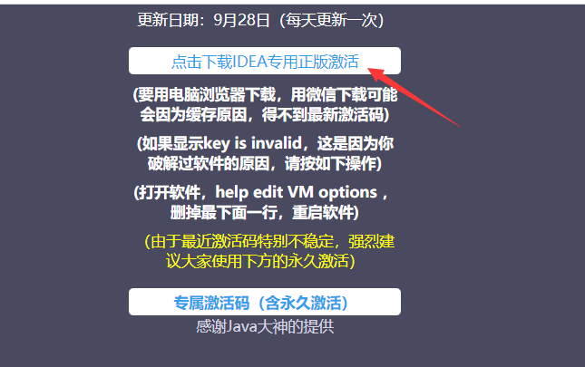

# idea激活码

**1.点击下面链接，下载破解码**

http://idea.medeming.com/idea/



**2.解压下载的文件，打开下面图示的文件，复制相应的破解码即可粘贴到idea相应位置上即可**


**3.说明**

因为上边的网站会实时更新，所以说如果过一段时间，破解码过期，那么按照上边前两步操作即可获得最新破解码

# 统一返回结果对象

一、统一返回数据格式
项目中我们会将响应封装成json返回，一般我们会将所有接口的数据格式统一， 使前端(iOS Android, Web)对数据的操作更一致、轻松。
一般情况下，统一返回数据格式没有固定的格式，只要能描述清楚返回的数据状态以及要返回的具体数据就可以。但是一般会包含状态码、返回消息、数据这几部分内容
例如，我们的系统要求返回的基本数据格式如下：
列表：

```java
{
  "success": true,
  "code": 20000,
  "message": "成功",
  "data": {
    "items": [
      {
        "id": "1",
        "name": "xiaoph",
        "intro": "毕业于河南大学，热爱编程"
      }
    ]
  }
}
```


分页：

```java
{
  "success": true,
  "code": 20000,
  "message": "成功",
  "data": {
    "total": 17,
    "rows": [
      {
        "id": "1",
        "name": "xiaoph",
        "intro": "毕业于河南大学，热爱编程"
      }
    ]
  }
}
```

没有返回数据：

```java
{
  "success": true,
  "code": 20000,
  "message": "成功",
  "data": {}
}
```

失败：

```java
{
  "success": false,
  "code": 20001,
  "message": "失败",
  "data": {}
}
```

因此，我们定义统一结果

```java
{
  "success": 布尔, //响应是否成功
  "code": 数字, //响应码
  "message": 字符串, //返回消息
  "data": HashMap //返回数据，放在键值对中
}
```

二、创建统一结果返回类
1、创建接口定义返回码
创建接口ResultCode.java

```java
public interface ResultCode {
    public static Integer SUCCESS = 20000;
    public static Integer ERROR = 20001;
}
```

2、创建结果类
创建类 R.java

```java
@Data
public class R {
    @ApiModelProperty(value = "是否成功")
    private Boolean success;

    @ApiModelProperty(value = "返回码")
    private Integer code;

    @ApiModelProperty(value = "返回消息")
    private String message;

    @ApiModelProperty(value = "返回数据")
    private Map<String, Object> data = new HashMap<String, Object>();

    private R(){}

    public static R ok(){
        R r = new R();
        r.setSuccess(true);
        r.setCode(ResultCode.SUCCESS);
        r.setMessage("成功");
        return r;
    }

    public static R error(){
        R r = new R();
        r.setSuccess(false);
        r.setCode(ResultCode.ERROR);
        r.setMessage("失败");
        return r;
    }

    public R success(Boolean success){
        this.setSuccess(success);
        return this;
    }
    
    public R message(String message){
        this.setMessage(message);
        return this;
    }

    public R code(Integer code){
        this.setCode(code);
        return this;
    }
    public R data(String key, Object value){
        this.data.put(key, value);
        return this;
    }

    public R data(Map<String, Object> map){
        this.setData(map);
        return this;
    }
}

```

三、在Controller中使用统一返回结果
列表

```java
@ApiOperation(value = "所有讲师列表")
@GetMapping
public R list(){
    List<Teacher> list = teacherService.list(null);
    return R.ok().data("items", list);
}
```


删除

```java
@ApiOperation(value = "根据ID删除讲师")
@DeleteMapping("{id}")
public R removeById(
    @ApiParam(name = "id", value = "讲师ID", required = true)
    @PathVariable String id){
    teacherService.removeById(id);
    return R.ok();
}
```